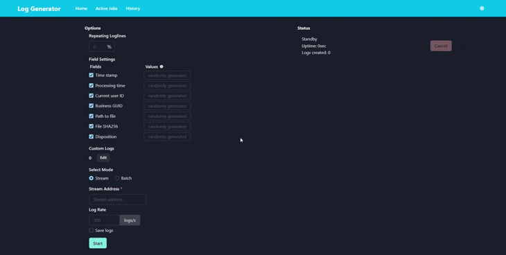
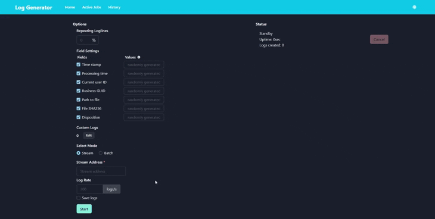
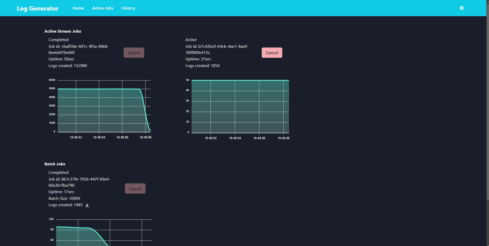
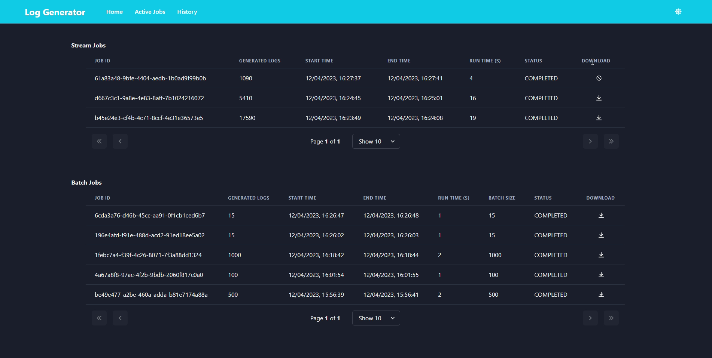
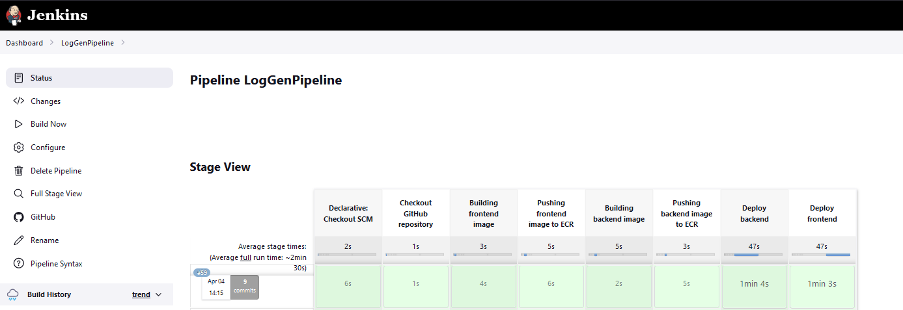

# Random Log Generator

Repository containing tools for generating semi-randomized computer telemetry (or log data)



# Team Members

- Chinwe Ajieh
- Florian Bache
- Ling Lee
- David Zarinski
- Advisor: Andy Wu

# Features

- Batch mode to generate a specified number of logs
- Streaming to endpoint at a specified log rate (logs/s)
- Customizable fields
- Custom Logs
- Uploading logs to S3 bucket
- Front end website created with React
- Active Jobs page to track all running jobs
- History page to see all past jobs

# Using the application

## Home Page


## Configuring Loglines To Be Generated

- Repeating Loglines
  - Enter the percentage chance that a log will be duplicated
- Field Settings  
  Select which fields to include in the generated logs. Each field will be randomly generated unless values are specified to be used. To provide multiple values separate them with a comma.
  - `Time stamp`
  - `Processing time`
  - `Current user ID`
  - `Business GUID`
  - `Path to file`
  - `File SHA256`
  - `Disposition`
- Custom Logs  
  The custom logs will be generated at the frequency specified. Custom logs will always contain the values that were specified for the fields. If a value for the field isn’t specified, it will be generated randomly or with the given field values.
  - `Edit` - press the edit button
  - In the pop-up window, add custom logs directly, or load from text or a json file
  - Additional fields can be added by specifing them in the json file or text box
  - Download button available to download the custom logs as a json file  
     

## Selecting a Mode

- Stream mode
  - Stream Address: Specify a `Stream Address` to stream to
  - Log Rate: Specify a `log rate` in logs/s. Select 0 or -1 for maximum rate available
  - Save logs: Select the checkbox if you'd like to save the streamed logs to file (S3 bucket)
  - Click `Start`  
    
- Batch mode
  - Number of Logs: Specify the number of logline to be included in the batch file
  - Click `Start`  
    

## Configuring Stream Address Endpoint

Log lines will be streamed to the address provided by sending HTTP POST requests. The endpoint will receive an array of up to 10 logs in JSON format with each request. The frequency of requests will be approximately the log rate specified divided by 10. All logs sent by a given job will have the same fields and contain information such as a timestamp, file path, and processing time. The endpoint should return a success or error response based on the outcome of the request. Streaming will be stopped upon receiving an error response or being cancelled.

```
POST /api/endpoint HTTP/1.1
Content-Type: application/json


[
  {
    "timeStamp":1082495877,
    "disposition":2,
    "currentUserID":"083550e9-1289-46af-be89-268ae1fd7ca9",
    "fileSHA256":"b6cdd8fa-848d-4a19-8da5-4d27425a5fa2",
    "pathToFile":"C:\\Program Files\\f9e3489b-06f9-49ff-b7a9-0f1e1ed100f1.json",
    "businessGUID":"f147180d-8961-459f-af10-121c593a0fa2",
    "processingTime":153
  },
  {
    "timeStamp":332981314,
    "disposition":4,
    "currentUserID":"5071c9ee-ec9f-429a-ba2a-e8c28707c3cf",
    "fileSHA256":"f0d789f7-7439-4d21-a811-fff027b90076",
    "pathToFile":"C:\\home\\ba8f8032-5ecb-408e-9218-e89f14ac4084.xlsx",
    "businessGUID":"142d09de-ce38-4b3c-8119-b04f9db82199",
    "processingTime":761
  },
  ...
]
```

## Active Jobs Page



## History Page



# Deployment

## Local Docker Deployment

### Overview
The full stack application is deployed via Docker containers running locally. Below is an overview of this implementation:
- Docker compose is used to create images of the frontend and backend by running their respective Dockerfiles
- Ports are assigned and the applications can be accessed via localhost port 8080 (backend) and port 3000 (frontend)
- Files are saved locally to the backend container and can be accessed via the terminal

### System Requirements
- Java version 19
- Docker installed

### Deploy the full stack application locally
1. Open Docker on your system
2. In the terminal navigate to root directory of the project cloned on your system
3. Run the command "docker compose up --build" <br/>
Note: If an error occurs ensure line endings are set to LF for the file /backend/mvnw and rerun step 2 <br/>
4. Navigate to the Containers tab within Docker Desktop -> the full stack app is now running


5. Navigate to localhost:3000 to use the application. Refer to the instructions for use above

## AWS Deployment

### Overview

The full stack application is deployed via AWS ECS with self-managed EC2 instances using an automated Jenkins pipeline. Below is an overview of the steps required to do so:

- Dockerfiles are used to create docker images of both the frontend and backend. These images are uploaded to AWS Elastic Container Repository (ECR)
- An Elastic Container Service (ECS) cluster is created and utilized as a container orchestration and management tool
- The ECS deploys both the frontend and backend images to containers which run on two different EC2 instances

### Configure AWS

Prior to running the Jenkins pipeline, AWS must be configured as outlined below.  
<b>Note:</b> These configuration steps only need to be completed once.

- ECR (Elastic Container Repository)
  - Create lg-backend repository
  - Create lg-frontend repository
- ECS (Elastic Container Service)
  - Create Cluster
    - EC2 Linux + Networking
      - Cluster name: ad1EcsCluster
      - EC2 instance type: t2.micro
      - VPC (create new)
        - CIDR: 10.0.0.0/16
        - Subnet 1: 10.0.0.0/24
        - Subnet 2: 10.0.1.0/24
      - Security Group (create new)
      - Container instance IAM role
        - Create new role
  - Task definitions
    - Create ad1-back task definition
      - Requires compatibilities
        - EC2
      - Task execution IAM role (create new)
      - Task size
        - Task memory: 800 MiB
        - Task cpu: 1024
      - Add container
        - Container name: ad1-back
        - Image: copy lg-backend image URI from ECR (latest)
        - Port mappings: 8080:8080
        - Environment variables
          - S3 credentials: accessKey + secretKey
          - EC2 instance URL: frontendURL
    - Create ad1-front task definition
      - Requires compatibilities
        - EC2
      - Task execution IAM role (create new)
      - Task size
        - task memory: 800 MiB
        - task cpu: 1024
      - Add container
        - Container name: ad1-front
        - Image: copy lg-frontend image URI from ECR (latest)
        - Port mappings: 80:3000
        - Environment variables
          - EC2 instance URL: backendURL
  - Services
    - Navigate to created cluster. Under Services tab click Create
      - Backend service
        - Launch type: EC2
        - Task Definition: ad1-back
        - Revision: latest
        - Service name: ad1-back
        - Number of tasks: 0
      - Frontend service
        - Launch type: EC2
        - Task Definition: ad1-front
        - Revision: latest
        - Service name: ad1-front
        - Number of tasks: 0
- EC2
  - Elastic IPs
    - backend
      - Allocate Elastic IP address
      - name backend
    - frontend
      - Allocate Elastic IP address
      - name frontend
  - Security Groups
    - Create security group
      - Security group name: ad1
      - VPC: Same as created in Cluster above
      - Inbound rules:
        - IP version Type Protocol Port range Source Description
        - All traffic All All default –
        - IPv4 HTTPS TCP 443 0.0.0.0/0 –
        - IPv4 Custom TCP TCP 8080 0.0.0.0/0 –
        - IPv6 HTTP TCP 80 ::/0 –
        - IPv6 Custom TCP TCP 8080 ::/0 –
        - IPv4 HTTP TCP 80 0.0.0.0/0 –
        - IPv6 HTTPS TCP 443 ::/0
  - EC2 instances
    - Create frontend instance
      - Application and OS Images: Ubuntu
      - Instance type: t2.micro
      - Network settings
        - Network: VPC created in cluster above
        - Subnet: Subnet created above
        - Select existing Security group: Security group created above
      - Name instance frontend after creation
      - Navigate to Elastic IPs - associate an IP with the EC2 instance
    - Create backend instance
      - Application and OS Images: Ubuntu
      - Instance type: t2.micro
      - Network settings
        - Network: VPC created in cluster above
        - Subnet: Subnet created above
        - Select existing Security group: Security group created above
      - Name instance frontend
      - Navigate to Elastic IPs - associate an IP with the EC2 instance

### Configure Jenkins

Jenkins must be configured to allow you to run the pipeline.  
<b>Note:</b> Jenkins must be installed on your system and the application launched. Download all standard plugins when prompted during install.

1. Navigate to the port specified during installation (i.e., localhost:8080)
2. Sign in with your credentials
3. Navigate to `Dashboard`->`Manage Jenkins`->`Plugin Manager` and download the following plugins:
   1. CloudBees AWS Credentials Plugin
   2. Docker: Docker API, Commons, Pipeline and plugin Plugins
   3. AWS: EC2 + SDK, ECR + SDK, ECS SDK and IAM SDK plugins
4. Navigate to `Dashboard`->`Manage Jenkins`->`Credentials` and enter in the following credentials:
   1. github_PAT
   2. jenkins-aws-admin
   3. jenkins-aws-s3
5. In the dashboard click `New Item`, select `Pipeline` and enter a pipeline name (e.g., LogGenPipeline)
6. Navigate to `Dashboard`->`LogGenPipeline`->`Configure` and enter the following configurations:
   1. `GitHub project`->`Project url`: https://github.com/andymbwu/log-generator
   2. `Pipeline`
      1. `Definition`: Pipeline script from SCM
      2. `SCM`: Git
      3. `Repository URL`: https://github.com/andymbwu/log-generator
      4. `Branches to build`->`Branch Specifier (blank for 'any')`: \*/main
      5. `Script Path`: JenkinsFile

### Deploy the full stack application to AWS

Note: If you've followed the AWS configuration steps for the first time outlined above, due to the allocation of
new elastic IPs you'll be required to update URLs within the source code in the `prod` branch prior to deploying to AWS. 
- Frontend -> update .env file
- Backend -> update java files: WebSocketConfig, LogController, LogsToFileController

To deploy the full stack application for the first time or for future updates follow the steps outlined below:

1. Open the Docker Desktop Application on your computer
2. Launch Jenkins
3. Run the pipeline by navigating to `Dashboard`->`LogGenPipeline` and selected `Build Now`  
   
4. The full stack application is now launched and can be accessed by the EC2 instance URLs + port number + API address (applicable to backend)
   1. For example, frontendURL to landing page: http://ec2-52-38-219-170.us-west-2.compute.amazonaws.com/
   2. For example, backendURL to stats API: http://ec2-100-20-95-225.us-west-2.compute.amazonaws.com:8080/api/v1/generate/stats <br/>